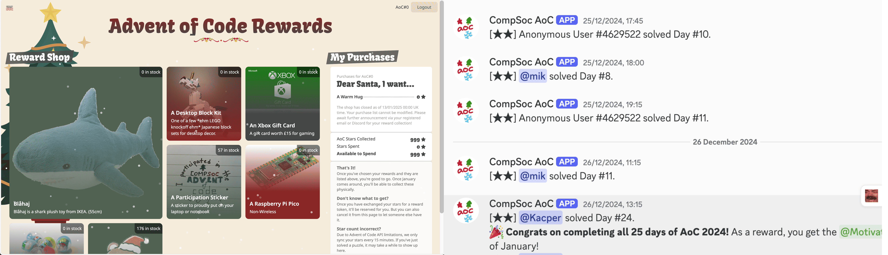

<p align="center">
  
</p>

# Adventure

Adventure is the Advent of Code Platform for CompSoc Edinburgh.

Every year, an instance of Adventure is launched during the period of December to
support students solving [AoC](https://adventofcode.com/) problems.

Adventure has three main components:
- **Core**: A cronjob that runs every 15 minutes to fetch latest star data from AoC
- **Notifier**: Discord Bot that notifies when someone completes their stars based on Core data
- **eShop**: Web platform for exchanging stars for tangible rewards based on Core data

There's also some connection between Notifier and eShop, where if you use the `/link_aoc` slash command on Discord, you get both prettified mentions by the Notifier as well as a double-auth on eShop to prevent account impersonation.

## Running with Docker

Adventure comes as a Docker image on `ghcr.io`. The recommended tag is `ghcr.io/compsoc-edinburgh/service-adventure:latest`.

The following command maps host port 80 to container port 3000, mounts the data directory to host `./data` and specifies environment variables from a file called `.env`.

```bash
docker run --env-file .env -v ./data:/app/data -p 80:3000 -it ghcr.io/compsoc-edinburgh/service-adventure:latest
```

### Configuration

The following environment variables need to be set for a successful run:

| Environment Variable | Explanation |
|---|---|
| AOC_SESSION_ID | **Core**: The session cookie contents from AoC. (Note! Expiry is ~1 month) |
| AOC_LEADERBOARD_IDS | **Core**: Comma-separated list of AoC leaderboard IDs to fetch data from |
| AOC_LEADERBOARD_JOIN_CODES | **eShop, Notifier**: Comma-separated list of AoC leaderboard join codes, with optional part in brackets to tag it. This is used for the Help screen in eShop and in the notifier's help menu. |
| DISCORD_TOKEN | **Notifier**: Discord bot token. Bot **must** be given Member intent permission in the Discord developer console |
| SLASH_GUILD_ID | **Notifier**: Guild ID to propagate slash commands to, e.g. `/link_aoc`. Bot **must** have slash command permissions in the guild. |
| WEBHOOK_ID | **Notifier**: Discord webhook ID for sending star achievement notifications |
| WEBHOOK_TOKEN | **Notifier**: Discord webhook token for sending star achievement notifications |
| COMPLETION_ROLE | **Notifier**: Discord role ID auto-given to people who complete 12 days of challenges |
| ADMIN_LOGIN | **eShop**: A long complex passstring to be used for the Admin to log in to the eShop |
| HOST | **eShop**: The deployment domain, (e.g. `localhost`, or `aoc.dev.comp-soc.com`). Used for secure cookies |
| OAUTH_DISCORD_CLIENT_ID | **eShop**: The Discord client ID with "identify" scope |
| OAUTH_DISCORD_REDIRECT_URI | **eShop**: The Discord redirect URL, must be approved on Discord Developers Console prior to use |

The following environment variables are optional:

| Environment Variable | Explanation |
|---|---|
| ABS_DATA_DIR | **Core**: The in-container location of the data directory. Defaults to `/app/data` |

In addition, the following volume mount must be present:

| Directory in Container | Explanation |
|---|---|
| `/app/data` | Contains a JSON mapping of from AoC ID to Discord ID, AoC star data, and caches |


## Local development

### Architecture


### Without Docker (recommended for testing indvidual components)

Frontend. You may need to edit `eshop/.env.development` as necessary.

```bash
cd eshop
yarn # Install dependencies
yarn dev # Start the development server
```

Notifier. You will need to provide arguments as necessary.

```bash
cd notifier
poetry install # Install dependencies
poetry run python3 -m aoc_bot [...] # Start the bot
```

Core. You will need to specify some environment variables, but it's just a shell script.

```bash
ABS_DATA_DIR=... [other_stuff....] ./core/fetch_stars.sh
```

### With Docker (recommended for end-to-end verification)

The combined Docker image uses `supervisord` to schedule the core, notifier, and
eshop as separate processes that all get started on launch.

```bash
docker build --tag adventure:latest .
docker run --env-file .env -v ./data:/app/data -p 3000:3000 -it adventure:latest
```
